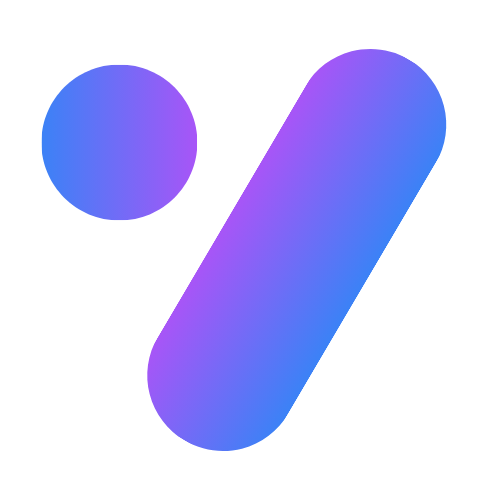
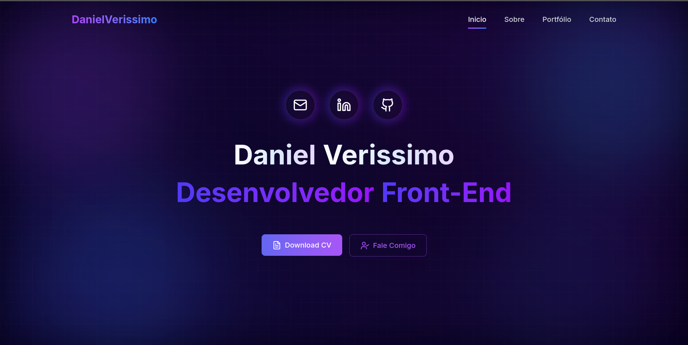

<h1 align="center">
  
  <br/>
  <p>Daniel Verissimo — Portfólio</p>
  <p>
    
    
    
  </p>
</h1>

**Daniel Verissimo — Portfólio** é uma aplicação web pessoal desenvolvida com **Next.js 15** e **TypeScript**, com foco em apresentar projetos, habilidades e experiências de forma moderna, responsiva e animada.

---

## 📸 Visualização do Projeto

<p align="center">
  
</p>

---

## 🚀 Funcionalidades

| Funcionalidade | Descrição |
|----------------|-----------|
| 🎨 **Hero Section** | Apresentação com animações AOS e links para redes sociais |
| 🧑‍💻 **Sobre mim** | Seção com informações pessoais e profissionais |
| 🗂️ **Portfólio** | Galeria de projetos com detalhes, tecnologias e links |
| 🏆 **Certificados** | Exibição de certificações obtidas |
| 📬 **Contato** | Formulário de contato com SweetAlert2 |
| 📄 **Download CV** | Download direto do currículo em PDF |
| 🔍 **SEO Otimizado** | Metadados configurados para melhor indexação |

---

## 🛠️ Tecnologias Utilizadas

<div align="center">
  
  
  
  
  
  
  
  
  
</div>

---

## 📚 Conceitos Aplicados

- Next.js 15 com App Router
- TypeScript com tipagem estrita
- Animações com GSAP, Framer Motion e AOS
- Componentização e separação de responsabilidades
- Roteamento dinâmico com `[slug]` para detalhes de projetos
- Tailwind CSS com design responsivo
- Otimização de imagens com `next/image`
- SEO com metadados no `layout.tsx`

---

## ▶️ Como Rodar o Projeto

Após clonar o repositório, siga os passos abaixo:

```bash
# Instalar as dependências
npm install

# Iniciar o servidor de desenvolvimento
npm run dev

# Gerar o build de produção
npm run build

# Iniciar em modo produção
npm start
```

Acesse [http://localhost:3000](http://localhost:3000) no navegador.

---

## 📁 Arquitetura do Projeto

```
daniel-portifolio/
│
├── public/
│   ├── certificates/          # Imagens dos certificados
│   ├── profile/               # Fotos de perfil
│   ├── projects/              # Thumbnails dos projetos
│   ├── tech-stack/            # Ícones das tecnologias
│   ├── favicon.png
│   ├── thambnail.png
│   └── Currículo - Daniel Verissimo.pdf
│
├── src/
│   ├── app/
│   │   ├── project/
│   │   │   └── [slug]/        # Página dinâmica de detalhes do projeto
│   │   ├── globals.css
│   │   ├── layout.tsx         # Layout raiz com metadados SEO
│   │   └── page.tsx           # Entry point da aplicação
│   │
│   ├── components/
│   │   ├── ProjectDetails/    # Componentes da página de detalhes
│   │   │   ├── AnimatedBackground.tsx
│   │   │   ├── FeatureItem.tsx
│   │   │   ├── ProjectActions.tsx
│   │   │   ├── ProjectFeatures.tsx
│   │   │   ├── ProjectHeader.tsx
│   │   │   ├── ProjectImage.tsx
│   │   │   ├── ProjectStats.tsx
│   │   │   ├── ProjectTechStack.tsx
│   │   │   └── TechBadge.tsx
│   │   ├── About.tsx          # Seção sobre mim
│   │   ├── AnimatedBackground.tsx
│   │   ├── CardProject.tsx    # Card de projeto
│   │   ├── Certificate.tsx    # Seção de certificados
│   │   ├── ClientWrapper.tsx
│   │   ├── Contact.tsx        # Seção de contato
│   │   ├── ContactForm.tsx    # Formulário de contato
│   │   ├── Footer.tsx
│   │   ├── NavBar.tsx
│   │   ├── Portofolio.tsx     # Seção de portfólio
│   │   ├── SocialLinks.tsx
│   │   ├── TechStackIcon.tsx
│   │   └── WelcomeScreen.tsx  # Hero section com animações AOS
│   │
│   ├── data/
│   │   ├── About.ts           # Dados da seção sobre mim
│   │   ├── Certificado.ts     # Dados dos certificados
│   │   ├── Projetos.ts        # Dados dos projetos
│   │   ├── SocialLinks.ts     # Links das redes sociais
│   │   └── Stack.ts           # Stack de tecnologias
│   │
│   └── lib/
│       ├── slug.ts            # Utilitário de geração de slug
│       └── utils.ts
│
├── next.config.ts
├── tsconfig.json
├── package.json
└── README.md
```

---

## 👨‍💻 Autor

<p align="center">
  
  <br/>
  <strong>Daniel Verissimo</strong>
  <br/>
  Desenvolvedor Front-End
</p>

<p align="center">
  <a href="https://linkedin.com/in/daniel-verissimo">
    
  </a>
  <a href="https://github.com/DanielVerissimo1">
    
  </a>
  <a href="https://daniel-verissimodev.vercel.app/">
    
  </a>
  <a href="mailto:danielsantoss1300@gmail.com">
    
  </a>
</p>

---

<p align="center">Feito com 💜 por <strong>Daniel Verissimo</strong></p>
